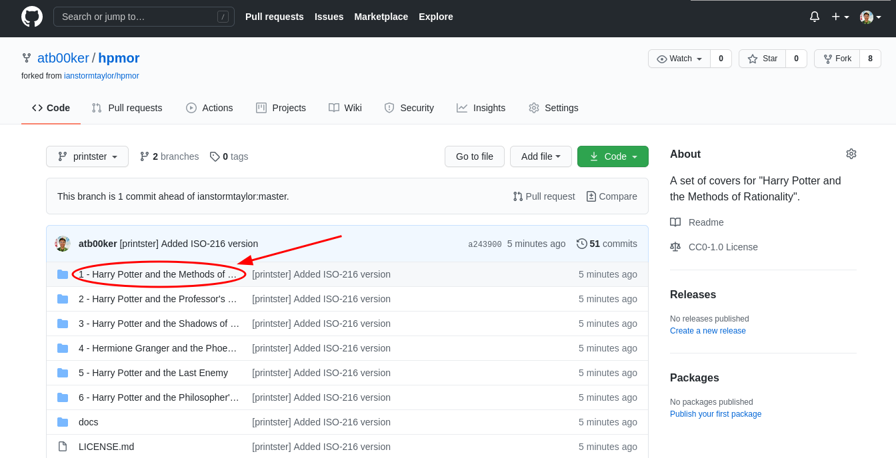
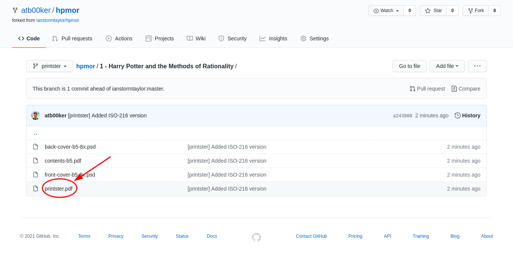
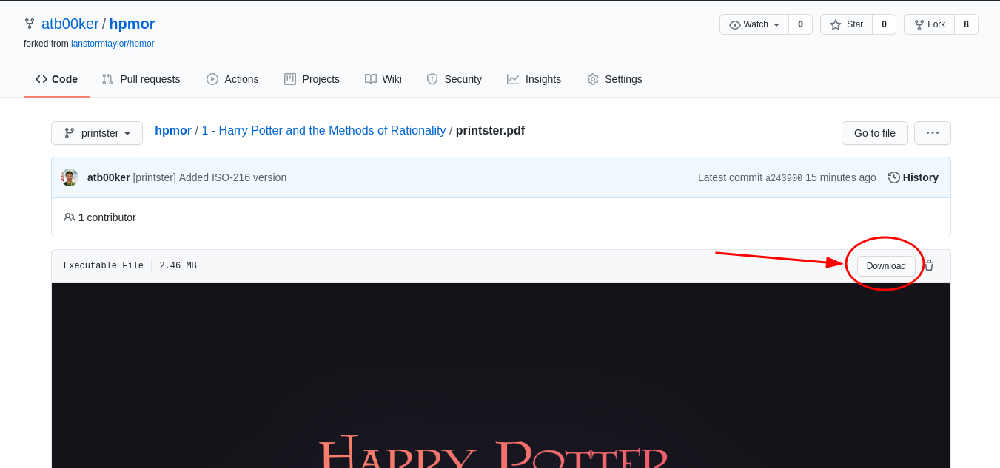
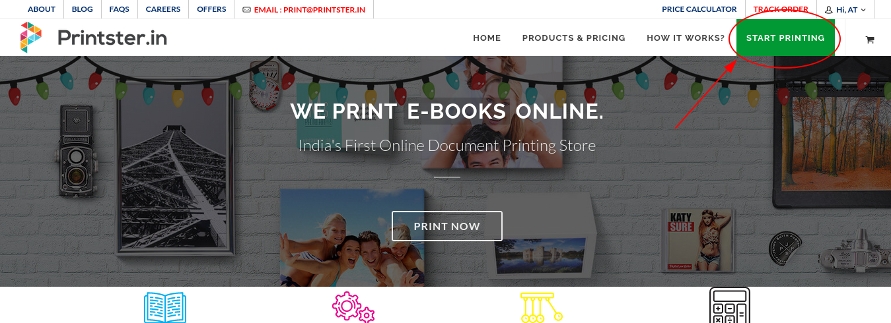
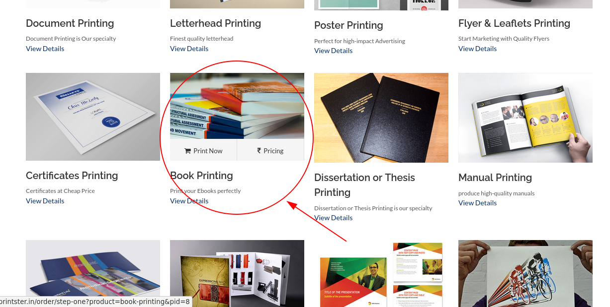
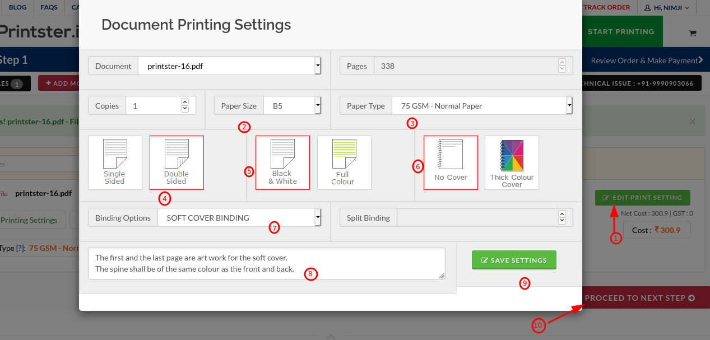

## Printster

**Note: Printster might not be able to deliver in your region, please find a local service in such case.**

Here is a walkthrough to get a hard copy using [printster.in](https://printster.in/), we will print the first part of the series (Harry Potter and the Methods of Rationality) in this walkthough.

Step 1: Go to [home page of the repository](https://github.com/atb00ker/hpmor) and click on the book's name.



Step 2: Click on `printster.pdf` to open the file.



Step 3: Download this file on your machine.



Step 4: Go to [printster.in](https://printster.in/) and click "Start Printing".



Step 5: Find and click "Book Printing".



Step 4: Upload the file you downloaded in the step 1, then:-

1. Click "edit print settings"
2. Paper Size: B5
3. Paper Type: 75 GSM - Normal Paper
4. Double Sided
5. Black & White
6. No Cover
7. Soft cover binding
8. Add instruction:

```text
The first and the last page are art work for the soft cover.
The spine shall be of the same colour as the front and back.
```

Now, Save settings (9) and "proceed to next step" (10).



Step 4: Enter your address & pay.

All done, have fun! :)

